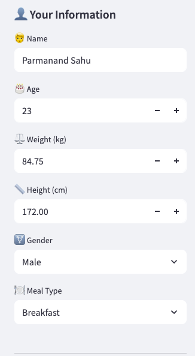

# 🍽️ NutriVision AI

<div align="center">
  
  <br>
  <em>Your AI-powered nutrition assistant</em>
</div>

Developed and Designed By:

Parmanand Sahu :   https://parmanandsahu.com/

Tula Ram Sahu :    https://in.linkedin.com/in/tula-ram-sahu-003226104

Website_Url :       https://foodnutrition-bedw5i7pctwrb9zuvu3jzg.streamlit.app/


### Note

This is not open source project.

We would like to inform you that the GitHub repository associated with the Perplexity Hackathon DevPost Challenge (https://perplexityhackathon.devpost.com/) is restricted for use by judges only.

This means that no one apart from the designated judges is permitted to access, clone, fork, or use the repository for any purpose.

## Problem Statement

Obesity is a growing health crisis in the United States, affecting 1 in 5 children and 2 in 5 adults, according to the CDC. It contributes to serious conditions like high blood pressure, type 2 diabetes, heart disease, and certain cancers—costing the healthcare system nearly $173 billion annually.

One of the biggest obstacles on a fitness journey is consistency—people struggle with lack of time, discipline, and the tedious process of tracking every meal. NutriVision AI directly addresses these issues by offering fast, accurate nutritional analysis from just a photo, making healthy eating easier and more accessible than ever.

## Overview

NutriVision AI is an intelligent food nutrition analyzer that helps users track their nutritional intake through image analysis. The application uses AI to analyze food images and provide detailed nutritional information.

### Mission :

To empower individuals to make informed nutritional choices by providing instant, accurate, and personalized food analysis through AI technology, making healthy eating accessible and effortless for everyone.

### Vision  :

To become the world's most trusted AI-powered nutrition assistant, transforming how people understand and manage their dietary habits, ultimately contributing to a healthier global community.

### Values  :

   1. Empowering Health Through Innovation
      - We simplify nutrition tracking using advanced AI, constantly enhancing our technology to give users greater control over their health.

   2. Accessible and Inclusive for Everyone
      - Our platform is easy to use, available on any device, and designed to make nutrition data understandable and actionable for all.

   3. Trustworthy and Health-Focused
      - We prioritize user privacy, deliver accurate nutritional insights, and promote balanced choices that support lifelong well-being.

## 🌟 Features

- 📸 Instant food image analysis
- 📊 Smart nutritional tracking
- 🎯 Personalized daily goals
- 📱 Cross-device compatibility
- 🔒 Secure and private

---

## 🔌 Perplexity API Integration : How perplexity is used

NutriVision AI leverages the Perplexity API to analyze food images and extract detailed nutritional information. Here's how it works:

1.  **Image Upload:** Users upload food images through the Streamlit interface.
2.  **API Call:** The app sends the image to the Perplexity API for analysis.
2.1 **Prompt:** This prompt instructs the AI to analyze a meal description and return only the core   nutritional values in a strict five-line format with no extra text or explanation.
3.  **Response Processing:** The API returns detailed nutritional data, which is then processed and displayed to the user.
4.  **Error Handling:** The app includes robust error handling to manage API failures gracefully.

For more details on the Perplexity API, visit [Perplexity Hackathon DevPost Challenge](https://perplexityhackathon.devpost.com/).

---

## 🚀 Quick Start : How to run the application in local machine

### Prerequisites

- Python 3.10 or higher
- Conda (Python package manager)
- Git
- Mac/Linux

### Installation

1. Clone the repository:
   ```bash
   git clone https://github.com/tula8891/food_nutrition.git
   cd food_nutrition
   ```

---

## 🐍 Conda Setup (Recommended)

If you use [Anaconda](https://www.anaconda.com/products/distribution) or [Miniconda](https://docs.conda.io/en/latest/miniconda.html), follow these steps for a fully reproducible environment:

1. **Create the Conda environment:**
   ```bash
   make setup-conda
   ```
2. **Activate the environment:**
   ```bash
   conda activate food-nutrition
   ```
3. **Run the setup (installs pip requirements, pre-commit, and creates secrets template):**
   ```bash
   make setup
   ```
   Note: A sample `secrets.toml` file will be created in the `.streamlit` directory. Update it with your actual API keys and credentials. Below is an example of the `secrets.toml` file:

   ```toml
   # secrets.toml
   [myconnection]
   YOUR_API_KEY = "Perplexity API Key"

   ```

4. **Run the web app:**
   ```bash
   make run
   ```
   This will run the application at [http://localhost:8501/](http://localhost:8501/)
5. **Use the app:**
   1. Open the web application locally by navigating to [http://localhost:8501/](http://localhost:8501/).
   2. Click the "Login" button and use the following default credentials:
      ```
      Username: test@example.com
      Password: test123
      ```
      *Note: Ensure there are no extra spaces before or after the credentials.*
   3. Enter your personal health information in the sidebar. This will automatically calculate and update your daily calorie requirements.

      

   4. After updating your health information, select a meal type (e.g., breakfast, lunch, dinner, or snacks). Then, go to the "Capture or Upload Your Food Image" section and click "Analyze."

      *Tip: You can use sample food images available in the `food_pics` folder for testing purposes.*
   5. View the results, which will display detailed calorie information and a breakdown of macronutrients present in the uploaded food image.

---

## 🛠️ Development

### Development Commands

```bash
# Install dependencies and set up development environment
make setup

# Run Streamlit application locally
make run

# Test all required package imports
make test-imports
```

### Code Quality Commands

```bash
# Format code with black and isort
make format

# Run flake8 code quality checks
make lint

# Run type checking with mypy
make type-check

# Run all pre-commit checks (format, lint, test)
make pre-commit
```

### Testing Commands

```bash
# Run tests with HTML and XML reports
make test

# Run tests with coverage report
make test-coverage

# Run async tests
make test-async
```

### Release Commands

```bash
# Get next version number based on git tags
make get-version

# Create and push a new release (VERSION=x.y.z optional)
make release VERSION=1.0.0
```

### Maintenance Commands

```bash
# Clean up cache files and test reports
make clean
```

## 🧪 Testing

The project uses pytest for testing. Test reports are generated in the `reports` directory:
- HTML test report: `reports/test-report.html`
- XML test report: `reports/test-report.xml`
- Coverage report: `reports/coverage/index.html`

### Testing Tools
- pytest: Core testing framework
- pytest-cov: Coverage reporting
- pytest-mock: Mocking capabilities
- pytest-asyncio: Async testing support

## 📝 Code Quality

### Code Style
- [Black](https://black.readthedocs.io/) (line length: 130)
- [isort](https://pycqa.github.io/isort/) for import sorting
- trailing-whitespace removal
- end-of-file-fixer

### Linting & Type Checking
- [Flake8](https://flake8.pycqa.org/) with custom ignores
- [mypy](https://mypy.readthedocs.io/) with strict optional types

### Security & Validation
- detect-private-key
- check-yaml
- check-merge-conflict

### Pre-commit Hooks
All quality checks are automated using pre-commit hooks. The configuration can be found in `.pre-commit-config.yaml`.

## 🤝 Contributing

1. Fork the repository
2. Create your feature branch (`git checkout -b feature/amazing-feature`)
3. Commit your changes (`git commit -m 'Add some amazing feature'`)
4. Push to the branch (`git push origin feature/amazing-feature`)
5. Open a Pull Request

## 📄 License

This project is licensed under the MIT License - see the [LICENSE](LICENSE) file for details.

## 👥 Authors

- [Parmanand Sahu](https://parmanandsahu.com/)
- [Tula Ram Sahu](https://in.linkedin.com/in/tula-ram-sahu-003226104)

## 🙏 Acknowledgments

- Streamlit for the amazing web framework
- Perplexity AI for the image analysis capabilities
- All contributors who have helped shape this project
